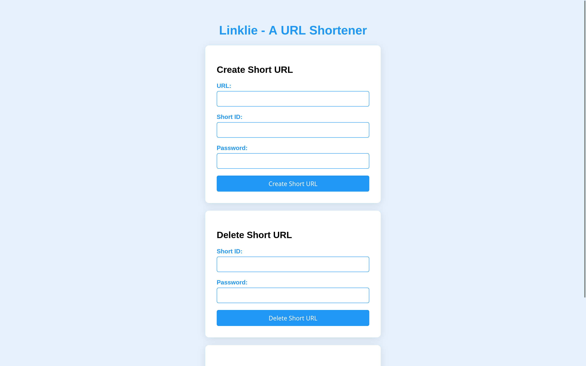

# Linklie - A URL shortener

## Features

### Password Protection for [Deletion](docs/DELETE-API.md)

- A password is required to delete a URL. You can set the deletion password in the web console.
- The password is stored as a hash in the database.

### Web UI

- A simple web interface is provided to allow users to add and delete URLs easily.
- The UI can be accessed at the root URL of the server.

### Custom URL

- Users can create custom short URLs instead of randomly generated ones. This feature allows for easy-to-remember links.

### Open Source

- Linklie is free and open source and available on [GitHub](https://github.com/kevinlee-06/linklie). Contributions are welcome!

### [Easy Deployment](docs/DEPLOY.md)

- Linklie can be easily deployed using Docker or Node.js. Follow the instructions below to get your server up and running in no time.

### [API](docs/API.md)

- Linklie provides a simple API for creating and deleting URLs. The API can be accessed using HTTP requests.

- User can create their own web dashboard using the API.

### No log policy

- The server does not store any visitor logs, ensuring user privacy and data protection.

