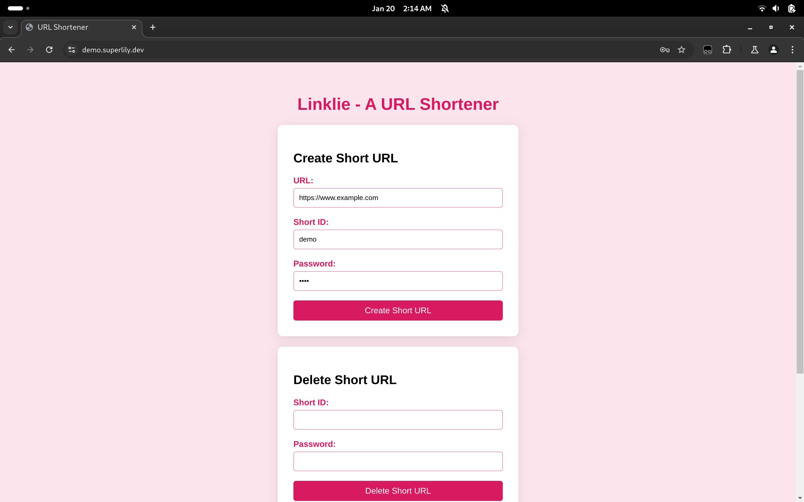

# Linklie - A URL shortener

## Features

### Password Protection for Deletion

- A password is required to delete a URL. You can set the deletion password in the web console.
- The password is stored as a hash in the database.

### Web UI

- A simple web interface is provided to allow users to add and delete URLs easily.
- The UI can be accessed at the root URL of the server.



### Custom URL

- Users can create custom short URLs instead of randomly generated ones. This feature allows for easy-to-remember links.

### Open Source

- Linklie is free and open source and available on [GitHub](https://github.com/kevinlee-06/linklie). Contributions are welcome!

### Easy Deployment

- Linklie can be easily deployed using Docker or Node.js. Follow the instructions below to get your server up and running in no time.

### API

- Linklie provides a simple API for creating and deleting URLs. The API can be accessed using HTTP requests.

- User can create their own web dashboard using the API.

### No log policy

- The server does not store any visitor logs, ensuring user privacy and data protection.

## Deploying with Docker

### Clone the repository

```sh
git clone https://github.com/kevinlee-06/linklie.git
cd linklie
```

### Build the Docker image

```sh
docker build -t kevinlee-06/linklie .
```

### Run the Docker container

```sh
docker run -p PORT:8080 kevinlee-06/linklie
```

### Example `docker-compose.yaml` file

```yaml
services:
  server:
    image: kevinlee-06/linklie
    ports:
      - 80:8080
```

> [!NOTE]  
> Don't forget to change the port in the `docker-compose.yaml` file.

## Deploying with Node.js

### Clone the repository

```sh
git clone https://github.com/kevinlee-06/linklie.git
cd linklie
```

### Run the server with Node.js

```sh
npm install
node server.js
```

> [!NOTE]  
> Don't forget to change the `PORT` in the `server.js` file.
